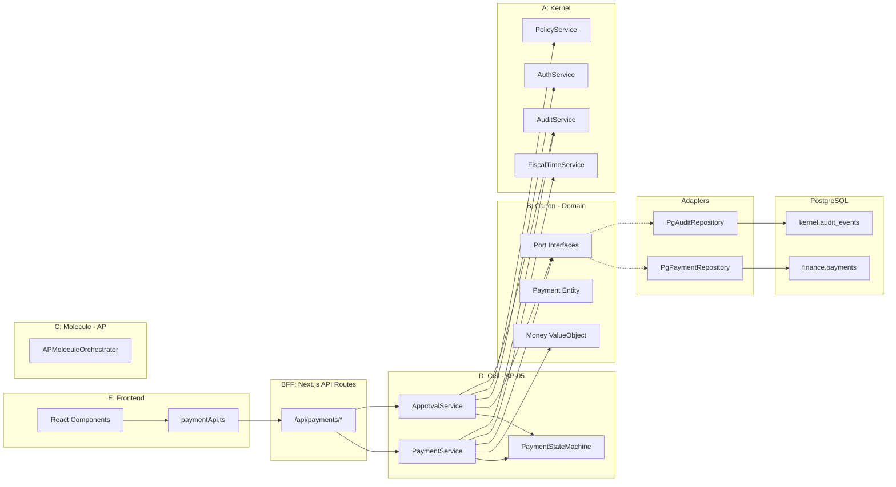

# PRD: AP-05 Payment Execution Cell (Enterprise Edition)

**Version:** 1.1.0

**Status:** Draft

**Scope:** AP-05 Payment Execution (Create, Approve, Submit, Execute, Complete, Fail, Retry)

**Approach:** Frontend-First with Early Port Definition

**Database Topology:** Monolithic Postgres with Schema Isolation (`kernel.*`, `finance.*`)

---

## Table of Contents

1. [Executive Summary](#1-executive-summary)
2. [Architecture Overview](#2-architecture-overview)
3. [Section A: Kernel Layer](#section-a-kernel-layer)
4. [Section B: Canon Layer (Domain)](#section-b-canon-layer-domain)
5. [Section C: Molecule Layer (AP Cluster)](#section-c-molecule-layer-ap-cluster)
6. [Section D: Cell Layer (AP-05)](#section-d-cell-layer-ap-05)
7. [Section E: Frontend Layer](#section-e-frontend-layer)
8. [Cross-Cutting Concerns](#8-cross-cutting-concerns)
9. [Phase Execution Plan](#9-phase-execution-plan)
10. [Success Criteria](#10-success-criteria)

---

## 1. Executive Summary

### 1.1 Objective

Build a **production-ready Payment Execution Cell** (AP-05) that:

- Enforces Segregation of Duties (Maker cannot Approve)
- Guarantees Transactional Audit (business + audit in same commit)
- Prevents duplicate payments (Idempotency)
- Handles concurrent approvals safely (Optimistic Locking)
- Never loses precision on money (String serialization)

### 1.2 Database Topology Decision

```
CONFIRMED: Monolithic Database with Schema Isolation
┌─────────────────────────────────────────────────────┐
│           PostgreSQL Instance (Local Docker)         │
├─────────────────────────────────────────────────────┤
│  ┌─────────────────┐     ┌─────────────────┐        │
│  │  kernel schema  │     │  finance schema │        │
│  │  (audit_events) │ <── │  (payments)     │        │
│  │  (users, roles) │     │  (approvals)    │        │
│  └─────────────────┘     └─────────────────┘        │
│                                                      │
│  SAME TRANSACTION = ATOMIC AUDIT GUARANTEE           │
└─────────────────────────────────────────────────────┘
```

---

## 2. Architecture Overview

### 2.1 Layer Responsibility Matrix

| Layer | Responsibility | Location | Owner |

|:------|:---------------|:---------|:------|

| **Kernel** | Cross-cutting: Auth, Audit, Time, Policy | `apps/kernel/`, `packages/kernel-*` | Platform Team |

| **Canon** | Domain primitives: Money, Actor, URN | `packages/canon-governance/` | Architecture |

| **Molecule** | AP cluster orchestration | `apps/canon/finance/ap/` | Finance Team |

| **Cell** | AP-05 Payment Execution logic | `apps/canon/finance/ap/cells/payment-execution/` | Finance Team |

| **Frontend** | UI/UX, API Client, State | `apps/web/src/modules/payment/` | Frontend Team |

### 2.2 Data Flow (Hexagonal Architecture)



---

## Section A: Kernel Layer

### A.1 Services Required by AP-05

| Service | Symbol | Purpose | Reliability | Failure Mode |

|:--------|:-------|:--------|:------------|:-------------|

| **Fiscal Calendar** | K_TIME | Validate payment date in open period | Blocking | Reject payment |

| **Authorization** | K_AUTH | JWT decode, RBAC check | Blocking | 401/403 |

| **Audit Trail** | K_LOG | Immutable evidence | **Transactional** | Rollback entire operation |

| **Policy Engine** | K_POLICY | Approval limits, SoD rules | Blocking | Reject action |

### A.2 Kernel Port Interfaces (Define in Phase 2)

**File:** `packages/kernel-core/src/ports/fiscalTimePort.ts`

```typescript
export interface FiscalTimePort {
  getPeriodStatus(date: Date, tenantId: string): Promise<PeriodStatus>;
  // Returns: 'OPEN' | 'SOFT_CLOSE' | 'HARD_CLOSE'
}
```

**File:** `packages/kernel-core/src/ports/auditPort.ts`

```typescript
export interface AuditPort {
  /**
   * TRANSACTIONAL: Must be called within the same DB transaction.
   * If audit fails, the entire transaction rolls back.
   * 
   * ENTERPRISE REQUIREMENT: For AP-05 material actions (submit/approve/reject/execute/complete/fail),
   * the domain mutation and the audit event **must commit in the same database transaction**;
   * if audit write fails, the action fails and **no state change is persisted**.
   */
  emitTransactional(
    event: AuditEvent,
    txContext: TransactionContext
  ): Promise<void>;
}

export interface TransactionContext {
  tx: PostgresTransaction;
  correlationId: string;
}
```

**File:** `packages/kernel-core/src/ports/policyPort.ts`

```typescript
export interface PolicyPort {
  evaluateSoD(creatorId: string, approverId: string): Promise<SoDResult>;
  getApprovalLimits(roleId: string, tenantId: string): Promise<ApprovalLimit[]>;
}
```

**File:** `packages/kernel-core/src/ports/eventBusPort.ts`

```typescript
/**
 * EventBusPort: Transactional Outbox Writer
 * 
 * CRITICAL: This port writes to an outbox table within the same database transaction.
 * A separate dispatcher process publishes events from the outbox after commit.
 * 
 * This ensures: (1) Events are never lost, (2) Events are published exactly-once,
 * (3) Domain mutation and event write are atomic.
 */
export interface EventBusPort {
  /**
   * Write event to transactional outbox (same DB transaction).
   * Does NOT publish immediately - dispatcher handles publication after commit.
   */
  writeToOutbox(
    eventType: string,
    payload: Record<string, unknown>,
    txContext: TransactionContext
  ): Promise<void>;
}
```

### A.3 Kernel Deliverables

| # | Deliverable | Location | Phase |

|:--|:------------|:---------|:------|

| A1 | `FiscalTimePort` interface | `packages/kernel-core/src/ports/` | P2 |

| A2 | `AuditPort` interface | `packages/kernel-core/src/ports/` | P2 |

| A3 | `PolicyPort` interface | `packages/kernel-core/src/ports/` | P2 |

| A4 | `MockAuditAdapter` (console.log) | `packages/kernel-adapters/src/memory/` | P2 |

| A5 | `PgAuditAdapter` (real) | `packages/kernel-adapters/src/sql/` | P4 |

---

## Section B: Canon Layer (Domain)

### B.1 Domain Primitives

#### B.1.1 Money Value Object (Critical)

**File:** `packages/canon-governance/src/primitives/Money.ts`

```typescript
/**
 * Money Value Object - NEVER use JavaScript floats for money.
 * All operations use string-based decimal arithmetic (decimal.js).
 */
export class Money {
  private readonly value: Decimal;
  readonly currency: CurrencyCode;

  private constructor(value: Decimal, currency: CurrencyCode) {
    this.value = value;
    this.currency = currency;
  }

  static fromString(amount: string, currency: CurrencyCode): Money {
    if (!/^\d+(\.\d{1,4})?$/.test(amount)) {
      throw new InvalidMoneyError(`Invalid amount format: ${amount}`);
    }
    return new Money(new Decimal(amount), currency);
  }

  static fromMinorUnits(cents: bigint, currency: CurrencyCode): Money {
    const decimal = new Decimal(cents.toString()).div(100);
    return new Money(decimal, currency);
  }

  toString(): string {
    return this.value.toFixed(4);
  }

  toJSON(): { amount: string; currency: string } {
    return { amount: this.toString(), currency: this.currency };
  }

  add(other: Money): Money {
    this.assertSameCurrency(other);
    return new Money(this.value.plus(other.value), this.currency);
  }

  isGreaterThan(other: Money): boolean {
    this.assertSameCurrency(other);
    return this.value.greaterThan(other.value);
  }

  private assertSameCurrency(other: Money): void {
    if (this.currency !== other.currency) {
      throw new CurrencyMismatchError(this.currency, other.currency);
    }
  }
}
```

#### B.1.2 Payment State Machine (Critical)

**File:** `packages/canon-governance/src/state-machines/PaymentStateMachine.ts`

```typescript
export type PaymentStatus = 
  | 'draft'
  | 'pending_approval'
  | 'approved'
  | 'rejected'
  | 'processing'
  | 'completed'
  | 'failed';

export type PaymentAction = 
  | 'submit'
  | 'approve'
  | 'reject'
  | 'execute'
  | 'complete'
  | 'fail'
  | 'retry';

const TRANSITIONS: Record<PaymentStatus, Partial<Record<PaymentAction, PaymentStatus>>> = {
  draft:            { submit: 'pending_approval' },
  pending_approval: { approve: 'approved', reject: 'rejected' },
  approved:         { execute: 'processing' },
  rejected:         {},  // Terminal
  processing:       { complete: 'completed', fail: 'failed' },
  completed:        {},  // Terminal
  failed:           { retry: 'pending_approval' },
};

export class PaymentStateMachine {
  static canTransition(current: PaymentStatus, action: PaymentAction): boolean {
    return TRANSITIONS[current]?.[action] !== undefined;
  }

  static getNextStatus(current: PaymentStatus, action: PaymentAction): PaymentStatus {
    const next = TRANSITIONS[current]?.[action];
    if (!next) {
      throw new IllegalStateTransitionError(current, action);
    }
    return next;
  }

  static isTerminal(status: PaymentStatus): boolean {
    return Object.keys(TRANSITIONS[status] || {}).length === 0;
  }

  static isImmutable(status: PaymentStatus): boolean {
    return ['approved', 'processing', 'completed'].includes(status);
  }
}
```

### B.2 Canon Deliverables

| # | Deliverable | Location | Phase |

|:--|:------------|:---------|:------|

| B1 | `Money` Value Object | `packages/canon-governance/src/primitives/` | P2 |

| B2 | `PaymentStateMachine` | `packages/canon-governance/src/state-machines/` | P2 |

| B3 | `ActorContext` type | `packages/canon-governance/src/primitives/` | P2 |

| B4 | `FinanceURN` utility | `packages/canon-governance/src/primitives/` | P2 |

---

## Section C: Molecule Layer (AP Cluster)

### C.1 Molecule Responsibility

The AP Molecule coordinates multiple Cells within the Accounts Payable domain:

- AP-01: Vendor Master (future)
- AP-02: Supplier Invoice (future)
- **AP-05: Payment Execution** (this PRD)
- AP-06: AP Aging (future)

### C.2 Shared AP Types

**File:** `apps/canon/finance/ap/types/index.ts`

```typescript
export interface APMoleculeContext {
  tenantId: string;
  companyId: string;
  fiscalPeriod: string;
  actor: ActorContext;
}

export interface VendorRef {
  vendorId: string;
  vendorName: string;
  bankAccount?: BankAccountRef;
}
```

### C.3 Molecule Deliverables

| # | Deliverable | Location | Phase |

|:--|:------------|:---------|:------|

| C1 | AP Molecule types | `apps/canon/finance/ap/types/` | P2 |

| C2 | AP Molecule README | `apps/canon/finance/ap/README.md` | P2 |

---

## Section D: Cell Layer (AP-05)

### D.1 Cell Contract (CONT_07 Section 4.5)

| Attribute | Value |

|:----------|:------|

| **Cell Code** | AP-05 |

| **Name** | Payment Execution |

| **Molecule** | Accounts Payable (P2P) |

| **Owner** | Finance Team |

| **Kernel Dependencies** | K_TIME, K_AUTH, K_LOG, K_POLICY |

| **Inbound Events** | `finance.ap.invoice.approved` (future) |

| **Outbound Events** | `finance.ap.payment.created`, `finance.ap.payment.approved` |

### D.2 Database Schema (Hardened)

**File:** `apps/db/migrations/finance/104_create_payments.sql`

```sql
-- ============================================================================
-- AP-05: Payment Execution Tables
-- Hardened for: Concurrency, Idempotency, Immutability
-- ============================================================================

CREATE TABLE finance.payments (
    -- Identity
    id UUID PRIMARY KEY DEFAULT uuid_generate_v4(),
    tenant_id UUID NOT NULL, -- RLS: Tenant isolation required (non-negotiable)
    company_id UUID NOT NULL,
    payment_number VARCHAR(50) NOT NULL,
    
    -- Vendor Reference
    vendor_id UUID NOT NULL,
    vendor_name VARCHAR(255) NOT NULL,
    
    -- Beneficiary Snapshot (at execution time - audit-proof)
    beneficiary_account_number VARCHAR(50),
    beneficiary_routing_number VARCHAR(50),
    beneficiary_bank_name VARCHAR(255),
    beneficiary_account_name VARCHAR(255),
    beneficiary_swift_code VARCHAR(11),
    beneficiary_snapshot_at TIMESTAMPTZ,
    
    -- Money (NUMERIC, never FLOAT)
    amount NUMERIC(19,4) NOT NULL,
    currency CHAR(3) NOT NULL DEFAULT 'USD',
    functional_currency CHAR(3) NOT NULL DEFAULT 'USD', -- Required if functional_amount exists
    fx_rate NUMERIC(19,6),
    functional_amount NUMERIC(19,4),
    
    -- Dates
    payment_date DATE NOT NULL,
    due_date DATE,
    
    -- Status (State Machine)
    status VARCHAR(20) NOT NULL DEFAULT 'draft'
        CHECK (status IN ('draft', 'pending_approval', 'approved', 
                          'rejected', 'processing', 'completed', 'failed')),
    
    -- Actors
    created_by UUID NOT NULL,
    approved_by UUID,
    approved_at TIMESTAMPTZ,
    executed_by UUID,
    executed_at TIMESTAMPTZ,
    
    -- Traceability (CONT_07: Drilldown)
    -- Source document is generic (invoice is one type, but not required)
    source_document_id UUID, -- NOT NULL enforced via application logic or constraint
    source_document_type VARCHAR(50) CHECK (source_document_type IN ('invoice', 'tax', 'payroll', 'bank_fee', 'deposit', 'prepayment', 'other')),
    journal_header_id UUID, -- GL posting reference (created on completion)
    
    -- Concurrency Control (Optimistic Locking)
    version INTEGER NOT NULL DEFAULT 1,
    
    -- Idempotency (Prevent duplicate creations)
    idempotency_key UUID,
    
    -- Audit timestamps
    created_at TIMESTAMPTZ DEFAULT NOW(),
    updated_at TIMESTAMPTZ DEFAULT NOW(),
    
    -- Constraints
    CONSTRAINT uq_payment_number UNIQUE (tenant_id, company_id, payment_number),
    CONSTRAINT uq_payment_idempotency UNIQUE (tenant_id, idempotency_key),
    
    -- SoD Enforcement: Maker cannot be Checker (DB-level)
    CONSTRAINT chk_sod_approved CHECK (
        (status NOT IN ('approved', 'processing', 'completed')) OR
        (approved_by IS NOT NULL AND approved_by <> created_by)
    ),
    
    -- Source document required for non-draft payments
    CONSTRAINT chk_source_document CHECK (
        (status = 'draft') OR
        (source_document_id IS NOT NULL AND source_document_type IS NOT NULL)
    )
);

-- Payment Approval History
CREATE TABLE finance.payment_approvals (
    id UUID PRIMARY KEY DEFAULT uuid_generate_v4(),
    payment_id UUID NOT NULL REFERENCES finance.payments(id),
    tenant_id UUID NOT NULL, -- RLS: Tenant isolation consistency
    level INTEGER NOT NULL DEFAULT 1,
    approver_id UUID NOT NULL,
    action VARCHAR(20) NOT NULL CHECK (action IN ('approved', 'rejected')),
    comment TEXT,
    decided_at TIMESTAMPTZ DEFAULT NOW(),
    
    -- Prevent duplicate approvals at same level
    CONSTRAINT uq_approval_level UNIQUE (payment_id, level)
);

-- Indexes
CREATE INDEX idx_payments_tenant_status ON finance.payments(tenant_id, status);
CREATE INDEX idx_payments_pending ON finance.payments(tenant_id, status) 
    WHERE status = 'pending_approval';
CREATE INDEX idx_payments_created_by ON finance.payments(created_by);

-- Immutability Trigger (CONT_07 Section 5.1)
CREATE OR REPLACE FUNCTION finance.prevent_payment_modification()
RETURNS TRIGGER AS $$
BEGIN
    IF OLD.status IN ('approved', 'processing', 'completed') THEN
        RAISE EXCEPTION 'Payment is immutable after approval: DELETE/UPDATE forbidden'
            USING HINT = 'To correct an error, create a reversal payment.',
                  ERRCODE = 'restrict_violation';
    END IF;
    RETURN OLD;
END;
$$ LANGUAGE plpgsql;

CREATE TRIGGER trg_immutable_approved_payments
BEFORE DELETE OR UPDATE ON finance.payments
FOR EACH ROW WHEN (OLD.status IN ('approved', 'processing', 'completed'))
EXECUTE FUNCTION finance.prevent_payment_modification();

-- Version Auto-Increment Trigger
CREATE OR REPLACE FUNCTION finance.increment_payment_version()
RETURNS TRIGGER AS $$
BEGIN
    NEW.version = OLD.version + 1;
    NEW.updated_at = NOW();
    RETURN NEW;
END;
$$ LANGUAGE plpgsql;

CREATE TRIGGER trg_payment_version
BEFORE UPDATE ON finance.payments
FOR EACH ROW EXECUTE FUNCTION finance.increment_payment_version();

-- Row Level Security (RLS) - Tenant Isolation (CONT_07 requirement)
ALTER TABLE finance.payments ENABLE ROW LEVEL SECURITY;
ALTER TABLE finance.payment_approvals ENABLE ROW LEVEL SECURITY;

CREATE POLICY payments_tenant_isolation ON finance.payments
    USING (tenant_id = current_setting('app.current_tenant_id')::UUID);

CREATE POLICY approvals_tenant_isolation ON finance.payment_approvals
    USING (tenant_id = current_setting('app.current_tenant_id')::UUID);
```

### D.3 Cell Services

#### D.3.1 PaymentService

**File:** `apps/canon/finance/ap/cells/payment-execution/PaymentService.ts`

```typescript
export class PaymentService {
  constructor(
    private paymentRepo: PaymentRepositoryPort,
    private auditPort: AuditPort,
    private timePort: FiscalTimePort,
    private eventBus: EventBusPort,
  ) {}

  async create(
    input: CreatePaymentInput,
    actor: ActorContext,
    idempotencyKey: string,
  ): Promise<Payment> {
    // 1. Validate period is open
    const periodStatus = await this.timePort.getPeriodStatus(
      input.paymentDate,
      actor.tenantId
    );
    if (periodStatus !== 'OPEN') {
      throw new PeriodClosedError(input.paymentDate);
    }

    // 2. Create Money value object (validates format)
    const amount = Money.fromString(input.amount, input.currency);

    // 3. Begin transaction
    return this.paymentRepo.withTransaction(async (txContext) => {
      // 4. Check idempotency
      const existing = await this.paymentRepo.findByIdempotencyKey(
        idempotencyKey,
        actor.tenantId,
        txContext
      );
      if (existing) return existing; // Return original, don't re-create

      // 5. Create payment (state: draft)
      const payment = await this.paymentRepo.create({
        ...input,
        amount: amount.toString(),
        status: 'draft',
        createdBy: actor.userId,
        idempotencyKey,
      }, txContext);

      // 6. Emit audit (TRANSACTIONAL - same transaction)
      await this.auditPort.emitTransactional({
        eventType: 'finance.ap.payment.created',
        entityId: payment.id,
        entityUrn: `urn:finance:payment:${payment.id}`,
        actor,
        payload: { action: 'created', after: payment },
      }, txContext);

      // 7. Write event to transactional outbox (same transaction)
      await this.eventBus.writeToOutbox(
        'finance.ap.payment.created',
        { paymentId: payment.id },
        txContext
      );

      // 8. Transaction commits here (audit + payment + outbox are atomic)

      // 9. Dispatcher will publish outbox events after commit

      return payment;
    });
  }
}
```

#### D.3.2 ApprovalService

**File:** `apps/canon/finance/ap/cells/payment-execution/ApprovalService.ts`

```typescript
export class ApprovalService {
  constructor(
    private paymentRepo: PaymentRepositoryPort,
    private auditPort: AuditPort,
    private policyPort: PolicyPort,
    private eventBus: EventBusPort,
  ) {}

  async approve(
    paymentId: string,
    actor: ActorContext,
    expectedVersion: number, // Optimistic locking
    comment?: string,
  ): Promise<ApprovalResult> {
    return this.paymentRepo.withTransaction(async (txContext) => {
      // 1. Fetch payment with version check
      const payment = await this.paymentRepo.findByIdForUpdate(
        paymentId,
        actor.tenantId,
        txContext
      );
      
      if (!payment) throw new PaymentNotFoundError(paymentId);
      
      // 2. Version check (concurrency control)
      if (payment.version !== expectedVersion) {
        throw new ConcurrencyConflictError(
          `Payment was modified. Expected v${expectedVersion}, found v${payment.version}`
        );
      }

      // 3. State machine check
      if (!PaymentStateMachine.canTransition(payment.status, 'approve')) {
        throw new IllegalStateTransitionError(payment.status, 'approve');
      }

      // 4. SoD check (Maker cannot be Checker)
      const sodResult = await this.policyPort.evaluateSoD(
        payment.createdBy,
        actor.userId
      );
      if (!sodResult.allowed) {
        throw new SoDViolationError(sodResult.reason);
      }

      // 5. Update status
      const nextStatus = PaymentStateMachine.getNextStatus(payment.status, 'approve');
      const updatedPayment = await this.paymentRepo.updateStatus(
        paymentId,
        {
          status: nextStatus,
          approvedBy: actor.userId,
          approvedAt: new Date(),
        },
        txContext
      );

      // 6. Record approval
      await this.paymentRepo.recordApproval({
        paymentId,
        level: 1,
        approverId: actor.userId,
        action: 'approved',
        comment,
      }, txContext);

      // 7. Emit audit (TRANSACTIONAL)
      await this.auditPort.emitTransactional({
        eventType: 'finance.ap.payment.approved',
        entityId: paymentId,
        entityUrn: `urn:finance:payment:${paymentId}`,
        actor,
        payload: {
          action: 'approved',
          before: { status: payment.status },
          after: { status: nextStatus },
        },
      }, txContext);

      // 8. Write event to transactional outbox (same transaction)
      await this.eventBus.writeToOutbox(
        'finance.ap.payment.approved',
        { paymentId, approvedBy: actor.userId },
        txContext
      );

      // 9. COMMIT (audit + payment + approval + outbox are atomic)

      // 10. Dispatcher will publish outbox events after commit

      return { success: true, payment: updatedPayment };
    });
  }

  async reject(
    paymentId: string,
    actor: ActorContext,
    expectedVersion: number,
    comment?: string,
  ): Promise<RejectionResult> {
    return this.paymentRepo.withTransaction(async (txContext) => {
      // Similar to approve, but transitions to 'rejected' state
      const payment = await this.paymentRepo.findByIdForUpdate(
        paymentId,
        actor.tenantId,
        txContext
      );
      
      if (!payment) throw new PaymentNotFoundError(paymentId);
      if (payment.version !== expectedVersion) {
        throw new ConcurrencyConflictError(
          `Payment was modified. Expected v${expectedVersion}, found v${payment.version}`
        );
      }

      if (!PaymentStateMachine.canTransition(payment.status, 'reject')) {
        throw new IllegalStateTransitionError(payment.status, 'reject');
      }

      const nextStatus = PaymentStateMachine.getNextStatus(payment.status, 'reject');
      const updatedPayment = await this.paymentRepo.updateStatus(
        paymentId,
        { status: nextStatus },
        txContext
      );

      await this.paymentRepo.recordApproval({
        paymentId,
        level: 1,
        approverId: actor.userId,
        action: 'rejected',
        comment,
      }, txContext);

      await this.auditPort.emitTransactional({
        eventType: 'finance.ap.payment.rejected',
        entityId: paymentId,
        entityUrn: `urn:finance:payment:${paymentId}`,
        actor,
        payload: {
          action: 'rejected',
          before: { status: payment.status },
          after: { status: nextStatus },
        },
      }, txContext);

      await this.eventBus.writeToOutbox(
        'finance.ap.payment.rejected',
        { paymentId, rejectedBy: actor.userId },
        txContext
      );

      return { success: true, payment: updatedPayment };
    });
  }
}
```

#### D.3.3 ExecutionService

**File:** `apps/canon/finance/ap/cells/payment-execution/ExecutionService.ts`

```typescript
export class ExecutionService {
  constructor(
    private paymentRepo: PaymentRepositoryPort,
    private auditPort: AuditPort,
    private eventBus: EventBusPort,
    private glPostingPort: GLPostingPort, // For GL integration
  ) {}

  async submit(
    paymentId: string,
    actor: ActorContext,
    expectedVersion: number,
  ): Promise<SubmissionResult> {
    return this.paymentRepo.withTransaction(async (txContext) => {
      const payment = await this.paymentRepo.findByIdForUpdate(
        paymentId,
        actor.tenantId,
        txContext
      );
      
      if (!payment) throw new PaymentNotFoundError(paymentId);
      if (payment.version !== expectedVersion) {
        throw new ConcurrencyConflictError(
          `Payment was modified. Expected v${expectedVersion}, found v${payment.version}`
        );
      }

      if (!PaymentStateMachine.canTransition(payment.status, 'submit')) {
        throw new IllegalStateTransitionError(payment.status, 'submit');
      }

      const nextStatus = PaymentStateMachine.getNextStatus(payment.status, 'submit');
      const updatedPayment = await this.paymentRepo.updateStatus(
        paymentId,
        { status: nextStatus },
        txContext
      );

      await this.auditPort.emitTransactional({
        eventType: 'finance.ap.payment.submitted',
        entityId: paymentId,
        entityUrn: `urn:finance:payment:${paymentId}`,
        actor,
        payload: {
          action: 'submitted',
          before: { status: payment.status },
          after: { status: nextStatus },
        },
      }, txContext);

      await this.eventBus.writeToOutbox(
        'finance.ap.payment.submitted',
        { paymentId },
        txContext
      );

      return { success: true, payment: updatedPayment };
    });
  }

  async execute(
    paymentId: string,
    actor: ActorContext,
    expectedVersion: number,
    beneficiarySnapshot: BeneficiarySnapshot, // Snapshot at execution time
  ): Promise<ExecutionResult> {
    return this.paymentRepo.withTransaction(async (txContext) => {
      const payment = await this.paymentRepo.findByIdForUpdate(
        paymentId,
        actor.tenantId,
        txContext
      );
      
      if (!payment) throw new PaymentNotFoundError(paymentId);
      if (payment.version !== expectedVersion) {
        throw new ConcurrencyConflictError(
          `Payment was modified. Expected v${expectedVersion}, found v${payment.version}`
        );
      }

      if (!PaymentStateMachine.canTransition(payment.status, 'execute')) {
        throw new IllegalStateTransitionError(payment.status, 'execute');
      }

      // Snapshot beneficiary details at execution time (audit-proof)
      const nextStatus = PaymentStateMachine.getNextStatus(payment.status, 'execute');
      const updatedPayment = await this.paymentRepo.updateStatus(
        paymentId,
        {
          status: nextStatus,
          executedBy: actor.userId,
          executedAt: new Date(),
          beneficiaryAccountNumber: beneficiarySnapshot.accountNumber,
          beneficiaryRoutingNumber: beneficiarySnapshot.routingNumber,
          beneficiaryBankName: beneficiarySnapshot.bankName,
          beneficiaryAccountName: beneficiarySnapshot.accountName,
          beneficiarySwiftCode: beneficiarySnapshot.swiftCode,
          beneficiarySnapshotAt: new Date(),
        },
        txContext
      );

      // Write payment instruction to outbox (for bank integration dispatcher)
      await this.eventBus.writeToOutbox(
        'finance.ap.payment.instruction.created',
        {
          paymentId,
          beneficiary: beneficiarySnapshot,
          amount: payment.amount,
          currency: payment.currency,
        },
        txContext
      );

      await this.auditPort.emitTransactional({
        eventType: 'finance.ap.payment.executed',
        entityId: paymentId,
        entityUrn: `urn:finance:payment:${paymentId}`,
        actor,
        payload: {
          action: 'executed',
          before: { status: payment.status },
          after: { status: nextStatus, beneficiary: beneficiarySnapshot },
        },
      }, txContext);

      await this.eventBus.writeToOutbox(
        'finance.ap.payment.executed',
        { paymentId, executedBy: actor.userId },
        txContext
      );

      return { success: true, payment: updatedPayment };
    });
  }

  async complete(
    paymentId: string,
    actor: ActorContext,
    expectedVersion: number,
    bankConfirmationRef: string,
  ): Promise<CompletionResult> {
    return this.paymentRepo.withTransaction(async (txContext) => {
      const payment = await this.paymentRepo.findByIdForUpdate(
        paymentId,
        actor.tenantId,
        txContext
      );
      
      if (!payment) throw new PaymentNotFoundError(paymentId);
      if (payment.version !== expectedVersion) {
        throw new ConcurrencyConflictError(
          `Payment was modified. Expected v${expectedVersion}, found v${payment.version}`
        );
      }

      if (!PaymentStateMachine.canTransition(payment.status, 'complete')) {
        throw new IllegalStateTransitionError(payment.status, 'complete');
      }

      const nextStatus = PaymentStateMachine.getNextStatus(payment.status, 'complete');
      
      // GL Posting Contract: Create GL entry on completion (bank-confirmed)
      // Dr AP Liability, Cr Cash
      const glEntry = await this.glPostingPort.createPaymentPosting({
        paymentId,
        tenantId: actor.tenantId,
        companyId: payment.companyId,
        amount: payment.functionalAmount || payment.amount,
        currency: payment.functionalCurrency || payment.currency,
        paymentDate: payment.paymentDate,
        bankConfirmationRef,
      }, txContext);

      const updatedPayment = await this.paymentRepo.updateStatus(
        paymentId,
        {
          status: nextStatus,
          journalHeaderId: glEntry.journalHeaderId,
        },
        txContext
      );

      await this.auditPort.emitTransactional({
        eventType: 'finance.ap.payment.completed',
        entityId: paymentId,
        entityUrn: `urn:finance:payment:${paymentId}`,
        actor,
        payload: {
          action: 'completed',
          before: { status: payment.status },
          after: { status: nextStatus, journalHeaderId: glEntry.journalHeaderId },
          bankConfirmationRef,
        },
      }, txContext);

      await this.eventBus.writeToOutbox(
        'finance.ap.payment.completed',
        { paymentId, journalHeaderId: glEntry.journalHeaderId, bankConfirmationRef },
        txContext
      );

      return { success: true, payment: updatedPayment, glEntry };
    });
  }

  async fail(
    paymentId: string,
    actor: ActorContext,
    expectedVersion: number,
    failureReason: string,
  ): Promise<FailureResult> {
    return this.paymentRepo.withTransaction(async (txContext) => {
      const payment = await this.paymentRepo.findByIdForUpdate(
        paymentId,
        actor.tenantId,
        txContext
      );
      
      if (!payment) throw new PaymentNotFoundError(paymentId);
      if (payment.version !== expectedVersion) {
        throw new ConcurrencyConflictError(
          `Payment was modified. Expected v${expectedVersion}, found v${payment.version}`
        );
      }

      if (!PaymentStateMachine.canTransition(payment.status, 'fail')) {
        throw new IllegalStateTransitionError(payment.status, 'fail');
      }

      const nextStatus = PaymentStateMachine.getNextStatus(payment.status, 'fail');
      const updatedPayment = await this.paymentRepo.updateStatus(
        paymentId,
        { status: nextStatus },
        txContext
      );

      await this.auditPort.emitTransactional({
        eventType: 'finance.ap.payment.failed',
        entityId: paymentId,
        entityUrn: `urn:finance:payment:${paymentId}`,
        actor,
        payload: {
          action: 'failed',
          before: { status: payment.status },
          after: { status: nextStatus },
          failureReason,
        },
      }, txContext);

      await this.eventBus.writeToOutbox(
        'finance.ap.payment.failed',
        { paymentId, failureReason },
        txContext
      );

      return { success: true, payment: updatedPayment };
    });
  }

  async retry(
    paymentId: string,
    actor: ActorContext,
    expectedVersion: number,
  ): Promise<RetryResult> {
    return this.paymentRepo.withTransaction(async (txContext) => {
      const payment = await this.paymentRepo.findByIdForUpdate(
        paymentId,
        actor.tenantId,
        txContext
      );
      
      if (!payment) throw new PaymentNotFoundError(paymentId);
      if (payment.version !== expectedVersion) {
        throw new ConcurrencyConflictError(
          `Payment was modified. Expected v${expectedVersion}, found v${payment.version}`
        );
      }

      if (!PaymentStateMachine.canTransition(payment.status, 'retry')) {
        throw new IllegalStateTransitionError(payment.status, 'retry');
      }

      const nextStatus = PaymentStateMachine.getNextStatus(payment.status, 'retry');
      const updatedPayment = await this.paymentRepo.updateStatus(
        paymentId,
        { status: nextStatus },
        txContext
      );

      await this.auditPort.emitTransactional({
        eventType: 'finance.ap.payment.retried',
        entityId: paymentId,
        entityUrn: `urn:finance:payment:${paymentId}`,
        actor,
        payload: {
          action: 'retried',
          before: { status: payment.status },
          after: { status: nextStatus },
        },
      }, txContext);

      await this.eventBus.writeToOutbox(
        'finance.ap.payment.retried',
        { paymentId },
        txContext
      );

      return { success: true, payment: updatedPayment };
    });
  }
}
```

#### D.3.4 GL Posting Port (Contract)

**File:** `packages/kernel-core/src/ports/glPostingPort.ts`

```typescript
/**
 * GL Posting Contract for AP-05
 * 
 * ENTERPRISE REQUIREMENT: GL entries are created on payment completion (bank-confirmed).
 * If payment fails after GL posting, reversal policy must be defined.
 * 
 * Posting: Dr AP Liability, Cr Cash
 */
export interface GLPostingPort {
  createPaymentPosting(
    input: PaymentPostingInput,
    txContext: TransactionContext
  ): Promise<GLPostingResult>;
}

export interface PaymentPostingInput {
  paymentId: string;
  tenantId: string;
  companyId: string;
  amount: string; // String money
  currency: string;
  paymentDate: Date;
  bankConfirmationRef: string;
}
```

### D.4 Cell Deliverables

| # | Deliverable | Location | Phase |

|:--|:------------|:---------|:------|

| D1 | `104_create_payments.sql` | `apps/db/migrations/finance/` | P3 |

| D2 | `PaymentRepositoryPort` | `apps/canon/finance/ap/ports/` | P2 |

| D3 | `PaymentService` | `apps/canon/finance/ap/cells/payment-execution/` | P3 |

| D4 | `ApprovalService` | `apps/canon/finance/ap/cells/payment-execution/` | P3 |

| D5 | `PgPaymentRepository` | `packages/kernel-adapters/src/sql/` | P3 |

| D6 | `MockPaymentRepository` | `packages/kernel-adapters/src/memory/` | P2 |

---

## Section E: Frontend Layer

### E.1 BFF Routes (Next.js API Routes)

**File:** `apps/web/src/app/api/payments/route.ts`

```typescript
// POST /api/payments - Create payment
export async function POST(request: NextRequest) {
  // Implementation with PaymentService.create()
}
```

**File:** `apps/web/src/app/api/payments/[id]/approve/route.ts`

```typescript
// POST /api/payments/[id]/approve - Approve payment
export async function POST(
  request: NextRequest,
  { params }: { params: { id: string } }
) {
  // Implementation with ApprovalService.approve()
}
```

**File:** `apps/web/src/app/api/payments/[id]/reject/route.ts`

```typescript
// POST /api/payments/[id]/reject - Reject payment
export async function POST(
  request: NextRequest,
  { params }: { params: { id: string } }
) {
  // Implementation with ApprovalService.reject()
}
```

**File:** `apps/web/src/app/api/payments/[id]/submit/route.ts`

```typescript
// POST /api/payments/[id]/submit - Submit for execution
export async function POST(
  request: NextRequest,
  { params }: { params: { id: string } }
) {
  // Implementation with ExecutionService.submit()
}
```

**File:** `apps/web/src/app/api/payments/[id]/execute/route.ts`

```typescript
// POST /api/payments/[id]/execute - Execute payment (bank instruction)
export async function POST(
  request: NextRequest,
  { params }: { params: { id: string } }
) {
  // Implementation with ExecutionService.execute()
  // Requires beneficiary snapshot in request body
}
```

**File:** `apps/web/src/app/api/payments/[id]/complete/route.ts`

```typescript
// POST /api/payments/[id]/complete - Complete payment (bank-confirmed)
export async function POST(
  request: NextRequest,
  { params }: { params: { id: string } }
) {
  // Implementation with ExecutionService.complete()
  // Creates GL posting, requires bankConfirmationRef
}
```

**File:** `apps/web/src/app/api/payments/[id]/fail/route.ts`

```typescript
// POST /api/payments/[id]/fail - Mark payment as failed
export async function POST(
  request: NextRequest,
  { params }: { params: { id: string } }
) {
  // Implementation with ExecutionService.fail()
  // Requires failureReason in request body
}
```

**File:** `apps/web/src/app/api/payments/[id]/retry/route.ts`

```typescript
// POST /api/payments/[id]/retry - Retry failed payment
export async function POST(
  request: NextRequest,
  { params }: { params: { id: string } }
) {
  // Implementation with ExecutionService.retry()
}
```

### E.2 API Client with Idempotency

**File:** `apps/web/src/modules/payment/api/paymentApi.ts`

```typescript
import { v4 as uuidv4 } from 'uuid';

export const paymentApi = {
  async create(data: CreatePaymentInput): Promise<Payment> {
    const idempotencyKey = uuidv4(); // Generate per action
    
    const res = await fetch('/api/payments', {
      method: 'POST',
      headers: {
        'Content-Type': 'application/json',
        'X-Idempotency-Key': idempotencyKey,
      },
      body: JSON.stringify({
        ...data,
        amount: data.amount.toString(), // Always string
      }),
    });
    
    return res.json();
  },

  async approve(
    id: string, 
    version: number, // For optimistic locking
    comment?: string
  ): Promise<ApprovalResult> {
    const res = await fetch(`/api/payments/${id}/approve`, {
      method: 'POST',
      headers: {
        'Content-Type': 'application/json',
        'X-Idempotency-Key': uuidv4(),
      },
      body: JSON.stringify({ version, comment }),
    });
    
    if (res.status === 409) {
      throw new ConcurrencyError('Payment was modified by another user');
    }
    
    return res.json();
  },

  async reject(
    id: string,
    version: number,
    comment?: string
  ): Promise<RejectionResult> {
    const res = await fetch(`/api/payments/${id}/reject`, {
      method: 'POST',
      headers: {
        'Content-Type': 'application/json',
        'X-Idempotency-Key': uuidv4(),
      },
      body: JSON.stringify({ version, comment }),
    });
    
    if (res.status === 409) {
      throw new ConcurrencyError('Payment was modified by another user');
    }
    
    return res.json();
  },

  async submit(id: string, version: number): Promise<SubmissionResult> {
    const res = await fetch(`/api/payments/${id}/submit`, {
      method: 'POST',
      headers: {
        'Content-Type': 'application/json',
        'X-Idempotency-Key': uuidv4(),
      },
      body: JSON.stringify({ version }),
    });
    
    if (res.status === 409) {
      throw new ConcurrencyError('Payment was modified by another user');
    }
    
    return res.json();
  },

  async execute(
    id: string,
    version: number,
    beneficiary: BeneficiarySnapshot
  ): Promise<ExecutionResult> {
    const res = await fetch(`/api/payments/${id}/execute`, {
      method: 'POST',
      headers: {
        'Content-Type': 'application/json',
        'X-Idempotency-Key': uuidv4(),
      },
      body: JSON.stringify({ version, beneficiary }),
    });
    
    if (res.status === 409) {
      throw new ConcurrencyError('Payment was modified by another user');
    }
    
    return res.json();
  },

  async complete(
    id: string,
    version: number,
    bankConfirmationRef: string
  ): Promise<CompletionResult> {
    const res = await fetch(`/api/payments/${id}/complete`, {
      method: 'POST',
      headers: {
        'Content-Type': 'application/json',
        'X-Idempotency-Key': uuidv4(),
      },
      body: JSON.stringify({ version, bankConfirmationRef }),
    });
    
    if (res.status === 409) {
      throw new ConcurrencyError('Payment was modified by another user');
    }
    
    return res.json();
  },

  async fail(
    id: string,
    version: number,
    failureReason: string
  ): Promise<FailureResult> {
    const res = await fetch(`/api/payments/${id}/fail`, {
      method: 'POST',
      headers: {
        'Content-Type': 'application/json',
        'X-Idempotency-Key': uuidv4(),
      },
      body: JSON.stringify({ version, failureReason }),
    });
    
    if (res.status === 409) {
      throw new ConcurrencyError('Payment was modified by another user');
    }
    
    return res.json();
  },

  async retry(id: string, version: number): Promise<RetryResult> {
    const res = await fetch(`/api/payments/${id}/retry`, {
      method: 'POST',
      headers: {
        'Content-Type': 'application/json',
        'X-Idempotency-Key': uuidv4(),
      },
      body: JSON.stringify({ version }),
    });
    
    if (res.status === 409) {
      throw new ConcurrencyError('Payment was modified by another user');
    }
    
    return res.json();
  },
};
```

### E.3 Money Input Component (String-only)

**File:** `apps/web/src/modules/payment/components/AmountInput.tsx`

```typescript
interface AmountInputProps {
  value: string; // Always string, never number
  onChange: (value: string) => void;
  currency: CurrencyCode;
}

export function AmountInput({ value, onChange, currency }: AmountInputProps) {
  const [displayValue, setDisplayValue] = useState(value);

  const handleChange = (e: React.ChangeEvent<HTMLInputElement>) => {
    const raw = e.target.value.replace(/[^0-9.]/g, '');
    
    // Validate format: up to 4 decimal places
    if (/^\d*(\.\d{0,4})?$/.test(raw)) {
      setDisplayValue(raw);
      onChange(raw);
    }
  };

  return (
    <div className="relative">
      <span className="absolute left-3 top-2 text-muted-foreground">
        {getCurrencySymbol(currency)}
      </span>
      <Input
        type="text"
        inputMode="decimal"
        value={displayValue}
        onChange={handleChange}
        className="pl-8 text-right font-mono"
      />
    </div>
  );
}
```

### E.4 Frontend Deliverables

| # | Deliverable | Location | Phase |

|:--|:------------|:---------|:------|

| E1 | `paymentApi.ts` | `apps/web/src/modules/payment/api/` | P1 |

| E2 | `AmountInput.tsx` | `apps/web/src/modules/payment/components/` | P1 |

| E3 | `CreatePaymentDialog.tsx` | `apps/web/src/modules/payment/components/` | P1 |

| E4 | `PaymentStatusBadge.tsx` | `apps/web/src/modules/payment/components/` | P1 |

| E5 | Zod schemas (string money) | `apps/web/src/modules/payment/schemas/` | P1 |

---

## 8. Cross-Cutting Concerns

### 8.1 Tenant Isolation (RLS) - Non-Negotiable

**Enterprise Requirement:** All AP-05 data access must enforce Row Level Security (RLS) for tenant isolation, consistent with CONT_07 architecture.

- **Database:** RLS policies on `finance.payments` and `finance.payment_approvals`
- **Application:** All repository queries must filter by `tenant_id` (defense in depth)
- **API Routes:** Extract `tenant_id` from authenticated session, never from client input
- **Audit:** All audit events must include `tenant_id` for traceability

### 8.2 Concurrency Control Summary

| Risk | Solution | Implementation |

|:-----|:---------|:---------------|

| Double approval | Optimistic Locking | `version` column + WHERE clause |

| Duplicate creation | Idempotency Key | `idempotency_key` column + unique constraint |

| Stale read | Version in response | Frontend sends `version` on mutation |

### 8.3 Money Governance Summary

| Layer | Rule | Implementation |

|:------|:-----|:---------------|

| Database | NUMERIC(19,4) | Never use FLOAT/DOUBLE |

| API | String serialization | `{ "amount": "1250.00" }` |

| Frontend | String state | Never parseFloat until display |

| Domain | Money Value Object | All math via `decimal.js` |

---

## 9. Phase Execution Plan

| Phase | Focus | Duration | Key Outputs |

|:------|:------|:---------|:------------|

| **P1** | Frontend Polish | Week 1 | CreatePaymentDialog, AmountInput, paymentApi, Zod schemas |

| **P2** | Mock API + Ports | Week 2 | All Port interfaces, MockPaymentRepository, Money VO, StateMachine |

| **P3** | Database + Backend | Week 3 | Migration, PgPaymentRepository, PaymentService, ApprovalService |

| **P4** | Kernel Integration | Week 4 | PgAuditAdapter, real K_TIME/K_AUTH integration, Control tests |

---

## 10. Success Criteria (CONT_07 KPIs)

| Metric | Target | Test |

|:-------|:-------|:-----|

| SoD Violations | 0 | `test_creator_cannot_approve_own_payment()` |

| Concurrency Conflicts Handled | 100% | `test_stale_version_returns_409()` |

| Idempotent Creates | 100% | `test_duplicate_key_returns_original()` |

| Period Lock Enforcement | 100% | `test_closed_period_payment_rejected()` |

| Audit Completeness | 100% | `test_every_mutation_has_audit_event()` |

| Money Precision | 0.0001 | `test_money_addition_preserves_precision()` |

| Immutability | 100% | `test_approved_payment_update_throws()` |