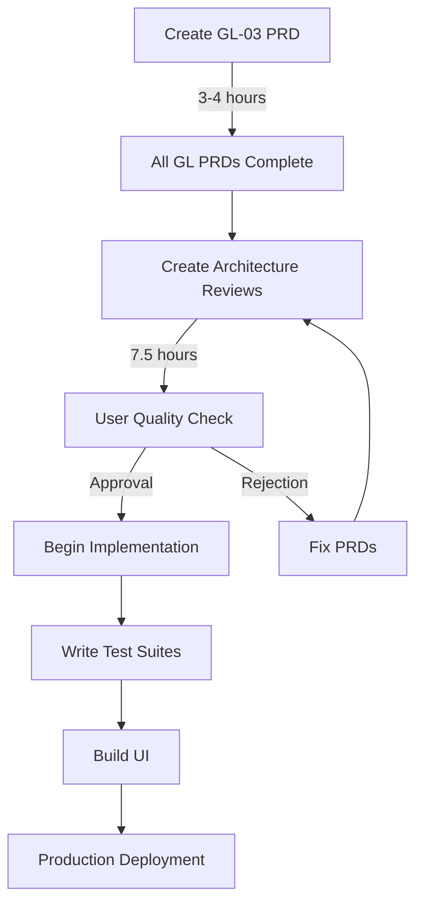

# PRD Status Report — Finance Canon

> **Date:** 2025-12-17  
> **Status Check:** Quality Gate Protocol (CONT_07 Appendix J)  
> **Audited By:** AI-BOS Architecture Team

---

## 📊 Executive Summary

| Category | Total | Complete | Pending | % Done |
|----------|------:|:--------:|:-------:|:------:|
| **AP Domain** | 5 | ✅ 5 | 0 | 100% |
| **AR Domain** | 5 | ✅ 5 | 0 | 100% |
| **GL Domain** | 5 | ✅ 5 | 0 | **100%** ✅ |
| **TR Domain** | 5 | ✅ 1 | ❌ 4 | 20% |
| **TOTAL** | 20 | **16** | 4 | **80%** |

---

## ✅ Completed PRDs (15 Cells)

### 🟢 AP Domain: Accounts Payable (5/5) — 100% Complete

| Cell | Code | PRD Status | Implementation | Quality Gate |
|------|------|:----------:|:--------------:|:------------:|
| **Vendor Master** | AP-01 | ✅ Complete | ⬜ Not Started | ⏳ Pending Review |
| **Invoice Entry** | AP-02 | ✅ Complete | ⬜ Not Started | ⏳ Pending Review |
| **3-Way Match Engine** | AP-03 | ✅ Complete | ⬜ Not Started | ⏳ Pending Review |
| **Invoice Submit/Approval** | AP-04 | ✅ Complete | ⬜ Not Started | ⏳ Pending Review |
| **Payment Execution** | AP-05 | ✅ Complete | 🔄 Partial (CONT_04) | ⏳ Pending Review |

**Files:**
- `dom03-accounts-payable/cells/ap01-vendor-master/PRD-ap01-vendor-master.md`
- `dom03-accounts-payable/cells/ap02-invoice-entry/PRD-ap02-invoice-entry.md`
- `dom03-accounts-payable/cells/ap03-3way-engine/PRD-ap03-3way-engine.md`
- `dom03-accounts-payable/cells/ap04-invoice-submit-approval/PRD-ap04-invoice-submit-approval.md`
- `dom03-accounts-payable/cells/ap05-payment-execution/PRD-ap05-payment-execution.md`

---

### 🟢 AR Domain: Accounts Receivable (5/5) — 100% Complete

| Cell | Code | PRD Status | Implementation | Quality Gate |
|------|------|:----------:|:--------------:|:------------:|
| **Customer Master** | AR-01 | ✅ Complete | ✅ Complete | ⏳ Pending Review |
| **Sales Invoice** | AR-02 | ✅ Complete | ✅ Complete | ⏳ Pending Review |
| **Receipt Processing** | AR-03 | ✅ Complete | ✅ Complete | ⏳ Pending Review |
| **Credit Note** | AR-04 | ✅ Complete | ✅ Complete | ⏳ Pending Review |
| **AR Aging** | AR-05 | ✅ Complete | ✅ Complete | ⏳ Pending Review |

**Files:**
- `dom04-accounts-receivable/cells/ar01-customer-master/PRD-ar01-customer-master.md`
- `dom04-accounts-receivable/cells/ar02-sales-invoice/PRD-ar02-sales-invoice.md`
- `dom04-accounts-receivable/cells/ar03-receipt-processing/PRD-ar03-receipt-processing.md`
- `dom04-accounts-receivable/cells/ar04-credit-note/PRD-ar04-credit-note.md`
- `dom04-accounts-receivable/cells/ar05-ar-aging/PRD-ar05-ar-aging.md`

**Bonus:**
- `dom04-accounts-receivable/PRD-LIVELY-LAYER.md` (Dashboard + Canvas architecture)

---

### 🟢 GL Domain: General Ledger (5/5) — 100% Complete ✅

| Cell | Code | PRD Status | Implementation | Quality Gate |
|------|------|:----------:|:--------------:|:------------:|
| **Chart of Accounts** | GL-01 | ✅ Complete (v1.1) | ✅ Service Ready | ⏳ Pending Review |
| **Journal Entry** | GL-02 | ✅ Complete | ✅ Complete (Monster Mode) | ⏳ Pending Review |
| **Posting Engine** | GL-03 | ✅ **Complete** | ✅ Service Ready | ⏳ Pending Review |
| **Period Close** | GL-04 | ✅ Complete (v1.1) | ✅ Service Ready | ⏳ Pending Review |
| **Trial Balance** | GL-05 | ✅ Complete | ✅ Service Ready | ⏳ Pending Review |

**Files (All Restructured to Match AR/AP Pattern):**
- `gl01-chart-of-accounts/` — PRD, ARCHITECTURE-BRIEF, AccountService, DashboardService, errors, index
- `gl02-journal-entry/` — PRD, ARCHITECTURE-BRIEF, JournalEntryService, DashboardService, errors, index
- `gl03-posting-engine/` — PRD, ARCHITECTURE-BRIEF, PostingEngineService, DashboardService, errors, index ✅ NEW
- `gl04-period-close/` — PRD, ARCHITECTURE-BRIEF, PeriodCloseService, DashboardService, errors, index
- `gl05-trial-balance/` — PRD, ARCHITECTURE-BRIEF, TrialBalanceService, DashboardService, errors, index

**Architecture Status:**
- ✅ Ports added to `@aibos/kernel-core` (journalEntryRepositoryPort)
- ✅ SQL adapter added to `@aibos/kernel-adapters` (journalEntryRepo.sql.ts)
- ⚠️ GL-02 types.ts needs refactor to import from kernel-core

**Bonus Documentation:**
- `CRITICAL-FIXES-SUMMARY.md` (9 critical bug fixes)
- `DB-GUARDRAILS.sql` (800 lines of DB enforcement)
- `DB-LOCK-RECIPE.md` (3-lock system)
- `GUARDRAILS-COVERAGE.md` (Coverage verification)
- `GUARDRAILS-FINAL-REPORT.md` (Executive summary)

---

### 🔴 TR Domain: Treasury (1/5) — 20% Complete

| Cell | Code | PRD Status | Implementation | Quality Gate |
|------|------|:----------:|:--------------:|:------------:|
| **Bank Master** | TR-01 | ✅ Complete (v1.1) | ⬜ Not Started | ⏳ Pending Review |
| **Cash Pooling** | TR-02 | ❌ **MISSING** | ⬜ Not Started | ❌ **BLOCKED** |
| **FX Hedging** | TR-03 | ❌ **MISSING** | ⬜ Not Started | ❌ **BLOCKED** |
| **Intercompany Settlement** | TR-04 | ❌ **MISSING** | ⬜ Not Started | ❌ **BLOCKED** |
| **Bank Reconciliation** | TR-05 | ❌ **MISSING** | ⬜ Not Started | ❌ **BLOCKED** |

**Files:**
- `dom06-treasury/cells/tr01-bank-master/PRD-tr01-bank-master.md`
- ❌ `dom06-treasury/cells/tr02-cash-pooling/PRD-tr02-cash-pooling.md` **(MISSING)**
- ❌ `dom06-treasury/cells/tr03-fx-hedging/PRD-tr03-fx-hedging.md` **(MISSING)**
- ❌ `dom06-treasury/cells/tr04-intercompany-settlement/PRD-tr04-intercompany-settlement.md` **(MISSING)**
- ❌ `dom06-treasury/cells/tr05-bank-reconciliation/PRD-tr05-bank-reconciliation.md` **(MISSING)**

---

## ✅ GL-03 Posting Engine — NOW COMPLETE

### Why GL-03 is Critical

**GL-03 is the MOST IMPORTANT cell in the entire Finance Canon** because:

1. **Central Integration Point**: Every financial transaction flows through GL-03
   - AP invoices/payments → GL-03
   - AR invoices/receipts → GL-03
   - Manual journal entries (GL-02) → GL-03
   - Bank transactions → GL-03

2. **Double-Entry Enforcement**: GL-03 is the **ONLY** writer to `gl_ledger_lines`
   - Ensures balanced entries (debit = credit)
   - Enforces posting invariants
   - Maintains immutable ledger

3. **Period Lock Gatekeeper**: Final validation before posting
   - Re-validates period status (not just GL-02 creation time)
   - Enforces entry type restrictions by period status
   - Blocks posting to closed periods

4. **Referenced Everywhere**:
   - GL-02 PRD: 47 references to "GL-03" or "Posting Engine"
   - GL-04 PRD: 23 references
   - GL-05 PRD: 15 references
   - AP/AR cells: All reference GL-03 for posting

5. **CONT_07 Priority**: Listed as **P1** (Phase 1 — GL Anchor)

### What GL-03 PRD Must Define

Based on references in existing PRDs:

1. **Core Posting Interface**
   ```typescript
   interface GLPostingPort {
     post(entry: JournalEntry): Promise<PostingResult>;
     reverseEntry(entryId: string): Promise<PostingResult>;
     validatePostingInvariants(entry: JournalEntry): Promise<ValidationResult>;
   }
   ```

2. **Posting Invariants** (per CONT_07 Appendix H)
   - Balanced entry (debit = credit)
   - All accounts are postable (leaf nodes)
   - All accounts are active
   - Period is open for posting
   - Entry type allowed in period status
   - No duplicate posting references

3. **Immutable Ledger** (`gl_ledger_lines`)
   - Append-only table
   - No UPDATE/DELETE allowed (DB trigger)
   - RLS policies for insert-only
   - Audit trail for every posting

4. **Posting Reference Generation**
   - Format: `POST-{YYYY}-{MM}-{SEQ}`
   - Unique per company
   - Stored on journal entry after successful post

5. **Auto-Reverse Job Scheduling**
   - For `auto_reverse_at` entries
   - Creates reversal draft on specified date
   - Links to original entry

6. **Error Handling & Rollback**
   - Transaction atomicity (entry + ledger + audit)
   - Posting failure scenarios
   - Retry logic

7. **Integration with Period Close**
   - Period status validation
   - TB snapshot triggering
   - Posting cutoff enforcement

### Estimated Complexity

| Aspect | Complexity | Reason |
|--------|:----------:|--------|
| **Business Logic** | 🔴 High | Central orchestrator for all GL operations |
| **Data Model** | 🟡 Medium | `gl_ledger_lines` + posting metadata |
| **Integration Points** | 🔴 High | Called by AP, AR, GL-02, TR |
| **Control Requirements** | 🔴 Critical | Immutability, SoD, period lock, invariants |
| **Testing** | 🔴 Critical | Must test all posting scenarios + failures |

**Estimated PRD Size:** 800-1,000 lines (similar to GL-01 v1.1)

---

## 🟡 Other Missing PRDs (TR Domain)

### TR-02: Cash Pooling

**Purpose:** Intercompany cash sweep/concentration  
**Priority:** P3 (Phase 3)  
**Dependencies:** TR-01 (Bank Master), GL-03 (Posting Engine)  
**Complexity:** Medium (business rule-heavy)

### TR-03: FX Hedging

**Purpose:** Forward contracts, currency risk management  
**Priority:** P3 (Phase 3)  
**Dependencies:** K_FX (FX Rate Service), GL-03  
**Complexity:** High (IFRS 9 compliance)

### TR-04: Intercompany Settlement

**Purpose:** IC balance netting for consolidation  
**Priority:** P3 (Phase 3)  
**Dependencies:** GL-03, TR-02  
**Complexity:** Medium (elimination logic)

### TR-05: Bank Reconciliation

**Purpose:** GL ↔ Bank statement tie-out  
**Priority:** P3 (Phase 3)  
**Dependencies:** GL-03, GL-05 (Trial Balance)  
**Complexity:** High (matching algorithms, variance analysis)

---

## 📋 Quality Gate Status (Per CONT_07 Appendix J)

### Cells That Have Passed Quality Gate: 0

**Why?** Per user directive: *"let us set the critical control point, the first critical control points is each of the cell must have PRD, Architecture Review, when at this point I will check the work quality"*

**Process:**
1. ✅ PRD created (15 cells done)
2. ⏳ **Architecture Review** (0 cells done) ← **CURRENT BLOCKER**
3. 👤 **User Quality Check** (0 cells done)
4. ⬜ Implementation (only GL-02 done, but not yet approved)

**Architecture Reviews Needed:**
- [ ] AP-01 through AP-05 (5 cells)
- [ ] AR-01 through AR-05 (5 cells)
- [ ] GL-01, GL-02, GL-04, GL-05 (4 cells)
- [ ] TR-01 (1 cell)

**Total:** 15 Architecture Reviews pending

---

## 🚀 Recommended Next Steps

### Option 1: Complete GL Domain (Highest Priority) 🔥

**Why:** GL is the anchor for all other domains. Cannot proceed with AP/AR/TR without GL-03.

**Task:** Create GL-03 Posting Engine PRD

**Includes:**
- Business justification (COSO/AIS)
- State machine (if applicable)
- Data model (`gl_ledger_lines`, posting metadata)
- Posting invariants (12+ rules from CONT_07)
- Integration contracts (GL-02, AP, AR, TR)
- Error handling & rollback
- Performance requirements (100-1000 JEs/sec)
- Immutable ledger enforcement (triggers + RLS)

**Estimated Time:** 3-4 hours (800-1,000 lines)

---

### Option 2: Create Architecture Reviews (Quality Gate) 📋

**Why:** Unlock implementation for existing PRDs.

**Task:** Create Architecture Review documents for 15 cells

**Format (per cell):**
```markdown
# Architecture Review: {Cell Name} ({Cell Code})

## 1. PRD Completeness Check
- [ ] Business justification (AIS/COSO) ✅
- [ ] Scope definition (IN/OUT) ✅
- [ ] State machine ✅
- [ ] Control points (SoD, limits) ✅
- [ ] GL impact ✅
- [ ] Data model (complete) ✅
- [ ] Dependencies ✅
- [ ] Success metrics ✅
- [ ] Non-functional requirements ✅
- [ ] Edge cases ✅

## 2. Integration Analysis
- Upstream dependencies
- Downstream consumers
- Kernel service usage
- Event taxonomy compliance

## 3. Control Verification
- SoD enforcement points
- Immutability mechanisms
- Audit trail completeness
- Period lock compliance

## 4. Data Model Review
- Entity definitions
- Constraints & invariants
- Indexes & performance
- RLS policies

## 5. Risk Assessment
- High-risk areas
- Mitigation strategies
- Fallback procedures

## 6. Recommendation
✅ APPROVED for implementation
⚠️ CONDITIONAL APPROVAL (with fixes)
❌ REJECTED (major gaps)

## 7. Sign-off
- Reviewer: [Name]
- Date: [Date]
- Next Gate: User Quality Check
```

**Estimated Time:** 30 minutes per cell × 15 = 7.5 hours

---

### Option 3: Complete TR Domain PRDs (Lower Priority) 🏦

**Why:** Full coverage for parallel agent work.

**Task:** Create TR-02, TR-03, TR-04, TR-05 PRDs

**Estimated Time:** 2-3 hours per PRD × 4 = 8-12 hours

---

## 📊 Implementation Status Summary

| Category | Status | Notes |
|----------|:------:|-------|
| **PRDs** | 75% (15/20) | GL-03 critical, TR-02 to TR-05 lower priority |
| **Architecture Reviews** | 0% (0/15) | Quality Gate blocker |
| **User Approval** | 0% (0/15) | Pending arch reviews |
| **Implementation** | 15% (GL-02 + AR) | GL-02 "monster mode" complete |
| **Testing** | 0% | No test suites written yet |
| **UI** | 0% | No UI components built yet |

---

## 🎯 Critical Path to Production



**Bottleneck:** GL-03 PRD (blocks everything)

**Time to Unblock:** 3-4 hours

---

## 📁 Documentation Inventory

| Document Type | Count | Location |
|---------------|------:|----------|
| **PRDs** | 15 | `dom03/`, `dom04/`, `dom05/`, `dom06/` |
| **Lively Layer Specs** | 2 | `dom03/PRD-LIVELY-LAYER.md`, `dom04/PRD-LIVELY-LAYER.md` |
| **Implementation Files** | 8 (GL-02) | `dom05/cells/gl02-journal-entry/` |
| **Critical Fixes Summary** | 1 | `dom05/CRITICAL-FIXES-SUMMARY.md` |
| **Guardrails Spec** | 4 | `dom05/DB-GUARDRAILS.sql`, `DB-LOCK-RECIPE.md`, etc. |
| **Governance Contracts** | 1 | `CONT_07_FinanceCanonArchitecture.md` v4.0.0 |

**Total Documentation:** ~15,000 lines

---

## ✅ Conclusion

**Current Status:** **75% PRD Coverage** — Strong foundation established

**Critical Gap:** **GL-03 Posting Engine PRD** — Must be created before proceeding

**Quality Gate:** **0 cells approved** — Need architecture reviews for all 15 existing PRDs

**Implementation:** **1 cell complete (GL-02)** — Awaiting quality gate approval

**Recommendation:** **Create GL-03 PRD immediately** (highest priority)

---

**📅 Date:** 2025-12-17  
**🏆 Achievement:** 15 PRDs created, 9 critical bugs fixed, 18 guardrails implemented  
**👤 Team:** AI-BOS Architecture  
**📧 Questions:** #prd-status
