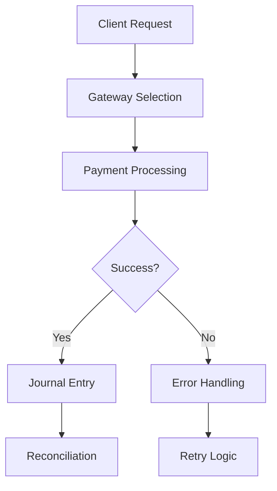

# Payment Hub

The Payment Hub serves as the central processing system for all financial transactions within the NexusCanon platform.

## Core Components

1. **Gateway Integration** - Unified interface to multiple payment processors
2. **Transaction Ledger** - Immutable record of all payment events
3. **Reconciliation Engine** - Automated matching of payments to invoices

## Gateway Support

| Gateway | Status | Features |
|---------|--------|----------|
| Stripe | ✅ Active | Cards, ACH, SEPA |
| PayPal | ✅ Active | Express Checkout, Subscriptions |
| Plaid | 🔄 In Progress | Bank Account Verification |

## Transaction Flow

## Integration with Core Systems

The Payment Hub integrates with:

- **META_01** (Metadata Architecture) for account structure
- **SYS_01** (System Bootloader) for configuration
- **SYS_02** (Organization) for multi-tenant support

## Security Considerations

All payment operations follow PCI-DSS compliance requirements:

- End-to-end encryption for all payment data
- Tokenization of sensitive information
- Role-based access control for payment operations

## Version History

| Version | Date | Changes |
|---------|------|---------|
| 0.1.0 | 2025-12-12 | Initial draft specification |

---

> **Next Steps:** Review [SYS_01: System Bootloader](/canon/system/sys-01-bootloader) for configuration options.
